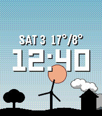
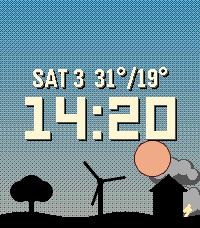
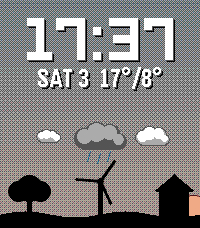
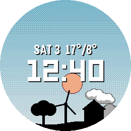
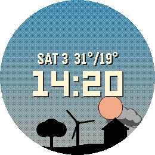
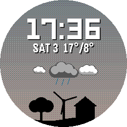

# Solar & Moon Arc

*The real sky on your wrist - now with the day's weather.*

     

A Pebble watchface (v2.2.0).

Watch the sky change through the day. The sun and moon move along curved
paths based on your location, declination and time. They rise and set at
the right horizon points and reach realistic heights for your latitude, not
a fixed fake arc. Whether you are north or south of the equator, the sun and
moon travel and orient themselves correctly for your hemisphere, including
which way the moon's phase faces.

The sky shifts smoothly from night through dawn, golden hour, daylight and
dusk, with the horizon color following a V-shaped curve: warm orange at
sunrise and sunset, fading to cool blue by midday and back again. A quiet
landscape sits along the horizon: tree, wind turbine and house.

New: the weather, told by the sky itself. Clouds grey the sky as they
gather, fog brightens the horizon, and the wind turbine turns with the real
wind - fast in a gale, standing still on a calm day. With the forecast
turned on, clouds sit on the sun's path at the hour the sun will reach
them, so you can see at a glance that it clears up at noon or that the sun
runs into rain mid-afternoon. Rain, snow and thunder show beneath their
clouds. Hours that have passed drop away, so the sky ahead of the sun is
always the weather still to come. After sunset the path shows tomorrow.

Prefer a fixed spot? The hourly view puts three clouds side by side: the
current hour large in the middle, the previous and the next hour smaller to
its left and right. Thin cloud cover gets a smaller cloud, a clear hour
leaves its place empty. The row sits at the top of the sky, or below the
date when the time is shown at the top.

Sun and moon always stay in front of the clouds. The weather adds to the
sky, it never hides what this watchface is for.

Location comes from your phone (GPS or fixed coordinates). Astronomical
data is refreshed once per day, the weather once per hour. The watchface
keeps a full day of forecast on the watch, so it continues to work for
hours without a phone connection. Weather data comes from Open-Meteo.com,
no account or API key needed. Built for round and rectangular Pebble
displays.

Sun and moon use high-contrast borders (dark red and black/white) so they
stay visible against any sky color. The landscape elements are spaced with
a small random offset so no two instances look exactly the same.

## Settings

Location
- Use fixed location - use the latitude and longitude below instead of the
  phone's GPS.

Display
- Show time at top - moves the time display up into the sky area, leaving
  the date in place.
- Auto cycle text color - time and date follow the sky: cool blue-white at
  night, warm yellow at golden hour and neutral white in daylight, with
  matching shadows.
- High contrast time & date - a fully outlined text style with a hard
  day/night flip: dark text on the bright daytime sky, light text at night.
  Designed for easier reading and overrides auto color.
- Show date - weekday and day number (e.g. SAT 13) above the time.
- Show moon - turn the moon on or off.
- Show moon phase - draws the moon's true illuminated shape (crescent,
  gibbous and so on) instead of a plain disc.
- Run sun & moon ahead of time - advances the sun and moon slightly along
  their paths and draws them in front of the clock, so you can see where
  they are heading. When off, they travel behind the time as usual.
- Animate wind turbine - the turbine spins briefly on every minute change
  and comes to rest at a slightly different angle each time. With weather
  on, the number of turns follows the wind speed.
- Vivid sky colors - richer, more saturated sky tones through the day and
  twilight.

Weather
- Weather - Off, Current sky and wind, Plus forecast on the sun path, or
  Plus last, current and next hour. Off by default.
- Show high / low temperature - the day's high and low in the date line, or
  in its place if the date is off. After sunset it shows tomorrow's. Needs
  weather turned on.
- Fahrenheit - temperatures in degrees Fahrenheit instead of Celsius.

## Platforms

- Pebble Time 2 (`emery`)
- Pebble Round 2 (`gabbro`)
- Pebble Time Round (`chalk`)
- Pebble Time (`basalt`)

## Building

With the [Pebble SDK](https://developer.repebble.com/sdk/):

```bash
pebble build
pebble install --emulator emery
```

The repository can also be imported into CloudPebble as is.

## Release notes

### 2.2.0

New hourly weather view: the previous, current and next hour as three clouds
side by side - the current hour large in the middle. A clear hour leaves its
place empty, thin cloud gets a smaller cloud, and rain, snow or thunder show
beneath. The row sits at the top of the sky, or below the date when the
time is at the top. Choose "Plus last, current and next hour" under Weather.

### 2.1.0

Weather, drawn into the sky. Clouds grey the sky, fog brightens the
horizon, and the wind turbine turns with the real wind. Optional forecast:
clouds, rain, snow and thunder sit on the sun's path at the hour the sun
will reach them; after sunset it shows tomorrow. Optional high and low
temperature in Celsius or Fahrenheit. Sun and moon always stay in front of
the clouds. Weather data by Open-Meteo.com, no API key needed. Weather is
off by default - turn it on in the settings.
